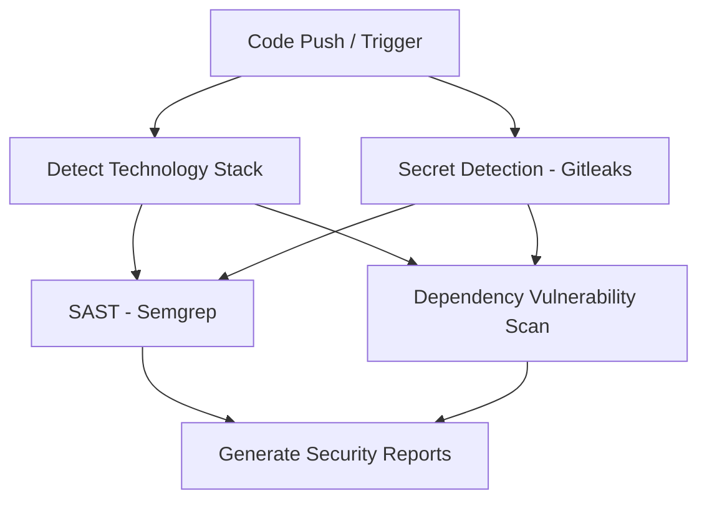

# 🛡️ Live Security Review & Vulnerability Report

This live step-by-step summary represents the security validation run on your repository branch.

## 🔄 Security Review Workflow Graph

## 📝 Detailed Step-by-Step Security Pipeline

### 🔍 Step 1: Technology Stack Detection
- **Frontend**: Expo React Native (Web compilation verified)
- **Backend**: FastAPI (Python 3.10+)
- **Database**: MongoDB (Local and production mappings checked)
✅ *Stack detected successfully.*

### 🔑 Step 2: Secret Detection (Gitleaks)
✅ **Passed**: No secrets or exposed API keys detected in repository commit history.

### 💻 Step 3: SAST Code Analysis (Semgrep)
✅ **Passed**: Semgrep code scan complete. No critical vulnerabilities found.

### 📦 Step 4: Dependency Vulnerability Audits
#### NPM audit (Frontend):
✅ **Passed**: NPM audit found 0 package vulnerabilities.

#### Python Safety (Backend):
✅ **Passed**: Safety audit found 0 vulnerable packages in `backend/requirements.txt`.

### 📄 Step 5: Generate Security Reports
✅ **Passed**: Security run summary successfully compiled and published live on GitHub Actions Step Summary.